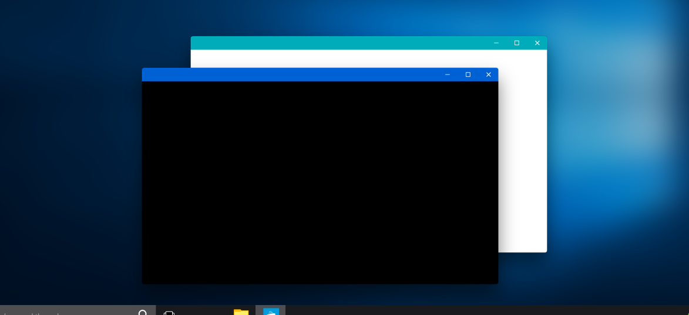

# electron-titlebar-windows [](https://travis-ci.org/sidneys/electron-titlebar-windows)

**Adds CSS-based Windows 10 Modern UI title bars to any Electron-based desktop app.**





# Installation

```
$ npm install --save electron-titlebar-windows
```


# API

### Importing the module

```js
const ElectronTitlebarWindows = require('electron-titlebar-windows');
```

### Creating a new instance

The module takes a single optional `options` argument and exports the `TitleBar` class:

```js
const titlebar = new ElectronTitlebarWindows(options);
```

Properties of `options`:
 - (optional) **darkMode** - `String` - **Light titlebar buttons (for dark backgrounds)**
 - (optional) **color** - `String` - **Icon color (Hex)**
 - (optional) **backgroundColor** - `String` - **Bar color (Hex)**
 - (optional) **draggable** - `Boolean` - **Titlebar enables dragging of contained window**
 - (optional) **fullscreen** - `Boolean` - **Resize button initializes in fullscreen mode**

### Methods

#### #appendTo

Shows the Title Bar.

```js
titlebar.appendTo(contextElement);
```

 - (optional) **contextElement** - `HTMLElement` - Default: `document.body` - **Element to which to add the titlebar**  


#### #destroy

Removes the Title Bar.

```js
titlebar.destroy();
```


### Events

`TitleBar` emits the following events:

- `minimize`
- `maximize`
- `fullscreen`
- `close`

```js
titlebar.on('close', function(e) {
    console.log('close');
});
```


## License

MIT © [sidneys](http://sidneys.github.io)


## Related

Based on [titlebar](https://github.com/kapetan/titlebar)
